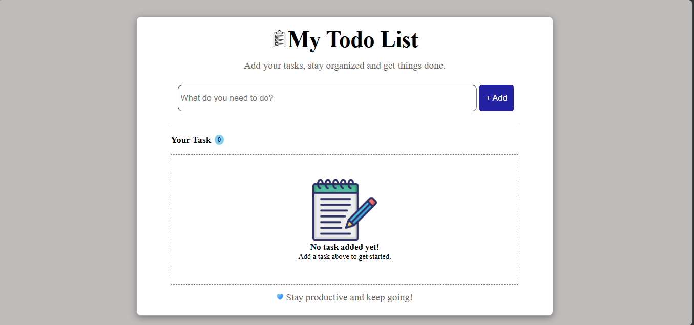

# 📝 ToDo List App

A simple and interactive ToDo List application built using HTML, CSS, and JavaScript with localStorage support to store tasks permanently in the browser.

---

## 🚀 Features

- Add new tasks  
- Delete tasks  
- Store tasks in localStorage  
- Data persists after page refresh  
- Simple and clean UI  

---

## 🛠️ Tech Stack

- HTML  
- CSS  
- JavaScript  
- localStorage (Browser API)

---

## 📸 Screenshot

> Screenshot file is placed in the root project folder.

---

## ▶️ How to Use

1. Open the project in a browser  
2. Type a task in the input box  
3. Click the Add button  
4. Task will appear in the list  
5. Refresh the page to see saved tasks  

---

## 📂 Project Structure

ToDo-App/
│
├── index.html  
├── style.css  
├── script.js  
├── screenshot.png 
├── imgs

